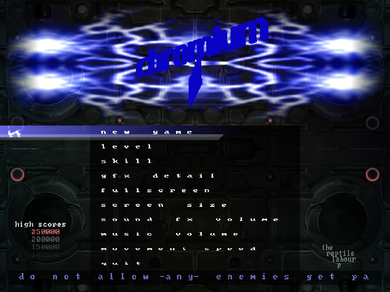
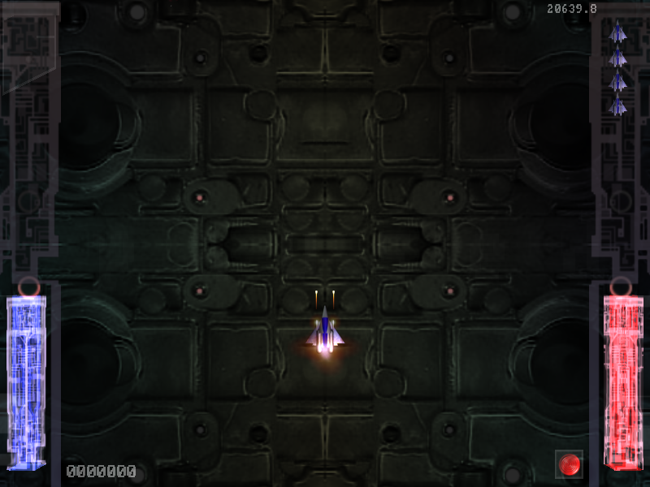

# Chromium B.S.U. — wasmcart port

[](https://github.com/wasmcart/chromium-bsu/actions/workflows/build.yml)
[](https://github.com/wasmcart/chromium-bsu/releases/latest)
[](COPYING)
[](https://wasmcart.org)

[Chromium B.S.U.](https://chromium-bsu.sourceforge.net/) built as a
[wasmcart](https://wasmcart.org) GL cart: one `.wasc` file that runs on any
conforming host — browser, Node, the native player, or a libretro core in
RetroArch.

**[wasmcart.org](https://wasmcart.org)** · [the spec and reference
host](https://github.com/wasmcart/wasmcart) ·
[download the cart](https://github.com/wasmcart/chromium-bsu/releases/latest)

Upstream is unchanged in spirit. This is a real source port, not a rewrite: the
game logic, assets and feel are the original's.





Both captured from the cart itself, through a wasmcart host.

## Build

Needs the [Emscripten SDK](https://emscripten.org) (`emcc`/`em++` on `PATH`).

```sh
bash build.sh    # -> build/chromium_bsu.wasm
bash pack.sh     # -> build/chromium_bsu.wasc  (wasm + data/png + data/wav)
```

Play it with any wasmcart host, for example:

```sh
npx wasmcart build/chromium_bsu.wasc
```

## What the port changes, and why

**Time instead of frame counts.** `Global::gameFrame` (an `int`) became
`Global::gameTime` (a `float`). The original advanced game state once per frame
and assumed a fixed rate; a wasmcart host renders at whatever rate the display
runs, and reports elapsed time in `wc_time_t.delta_ms`. Enemy movement, spawn
timing, explosions and terrain scroll now integrate against real time, so the
game plays the same at 60 Hz and 144 Hz. This touches most of `src/` — it is the
bulk of the diff.

**GL 1.x to ES 3.0.** wasmcart's GPU ABI is WebGL2 (ES 3.0), which has no
immediate mode. `src/Renderer.{h,cpp}` implements a batching ES 3.0 drawing API
that accumulates the original's `glBegin`/`glEnd` runs into vertex buffers.
`src/wasmcart_port.h` is force-included before every translation unit
(`-include`, see `build.sh`) and redirects the game's GL, SDL and config calls
onto the port's own implementations.

**Host-shaped entry points.** `src/chromium_cart.cpp` implements the cart ABI
(`wc_get_info`, `wc_init`, `wc_render`) and maps the gamepad: d-pad or left stick
to move, `A` to fire and to confirm menu items, `START` for the menu.

**Audio through the cart's ring buffer.** `src/AudioWasmcart.{h,cpp}` replaces
SDL_mixer, mixing the original `.wav` assets into the buffer the host drains each
frame.

**Text without a font library.** `src/TextBitmap.{h,cpp}` draws the original's
bitmap font directly, so no FreeType dependency.

`porting/` holds the vendored wasmcart headers plus `stb_image.h`. Keep the
wasmcart ones in step with upstream using that repo's
`scripts/sync-headers.sh` — they are copies, not a fork.

`pack.sh` stages assets into `build/assets/` (gitignored) rather than `/tmp`,
which wipes on reboot.

## Building the original (non-wasmcart)

The upstream autotools build is untouched and still works. See `README`,
`README.install` and `INSTALL`, plus the manual page, FAQ and info pages.

## More

- **[wasmcart.org](https://wasmcart.org)** — what wasmcart is, and other carts
- [wasmcart/wasmcart](https://github.com/wasmcart/wasmcart) — the spec, the ABI
  header, and the reference hosts
- [Releases](https://github.com/wasmcart/chromium-bsu/releases) — prebuilt
  `.wasc`, no toolchain needed

## Licensing

Unchanged from upstream: Chromium B.S.U. is under the Clarified Artistic License
(`COPYING`), and the sounds are MIT/Expat (`data/wav/license.txt`). The porting
work here is under the same terms as the game.
